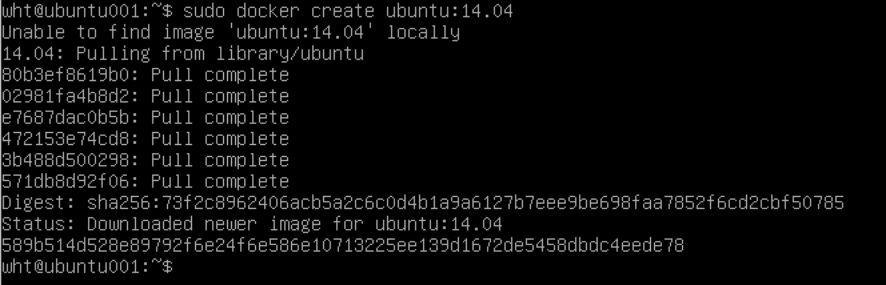

<h1>容器 </h1>
<h3>1.创建容器 (docker create , docker run)</h3>

1.1: docker create 与 docker run 区别

&emsp; 用docker create 创建的容器处于停止状态，docker run 创建容器并启动。

1.2：docker create实例

&emsp; sudo docker create ubuntu:14.04 </code>

&emsp; 创建完容器之后，会返回容器的ID，例如图中的589....,每一个容器ID都是唯一的。

&emsp; docker ps 查看当前正在运行的容器(此时，没用任何运行的容器)

&emsp; docker ps -a 查看所有的容器，包括未运行的容器

&emsp; 使用docker start 启动容器

1.3：docker run实例

&emsp; 想要让创建的容器立马进入运行状态，可以使用docker run命令，该命令等同于docker create创建容器之后再使用docker start启动容器。使用docker run命令，可以创建两种类型的容器：后台型容器和交互型容器。

&emsp; * 交互型容器：运行在前台，通常会指定有交互的控制台，可以给容器输入，也可以得到容器的输出。创建该容器的终端被关闭，在容器内部使用exit命令或者调用了docker stop、docker kill命令后，容器会变成停止状态。

&emsp; * 后台型容器：运行在后台，创建启动之后就与终端无关。即便终端关闭了，该后台容器也依然存在，只有调用了docker stop或docker kill命令时才能够使容器变成停止状态。

&emsp; 创建一个交互型容器：

&emsp; sudo docker run -i -t --name=inspect_shell ubuntu /bin/bash

&emsp; -i 打开容器的标准输入（STDIN），-t 为容器建立一个命令行终端。这两个标志为我们和容器提供了交互shell，是创建交互型容器的基本设置。--name标志为容器指定一个名字，这是一个可选项。当没有这个选项时，docker会取一个随机的名字。接下来，我们告诉docker使用哪个镜像去创建容器，这里使用的是ubuntu，可以是ubuntu,fedora,debian,centos等。这里我们只是用基础镜像来启动容器，没有添加任何东西。最后，告诉docker在容器里面执行命令/bin/bash。

&emsp; 当我们运行docker run命令后，docker在本地搜搜我么指定的ubuntu镜像，如果没有找到，就会到公有仓库Docker Hub中继续搜索。如果在服务器上找到了需要的镜像，docker就会下载这个镜像，并将其保存到本地。然后，docker使用这个镜像创建一个新的容器并将其启动；容器的文件系统是在只读的镜像文件上增加一层可读写的文件层，这样可以保证镜像不变而只记录改变的数据，这对容器的共享和传输都非常有利。接着会配置容器的网络，docker会为容器分配一个虚拟网络j接口，并通过网桥的方式将该网络接口桥接到宿主主机上去，让后该虚拟网络接口分配一个ip地址。最后，docker在新容器中运行指定的命令，例如我们的例子中国的/bin/bash。

