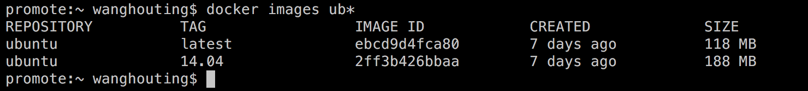

<h1>查看镜像</h1>

&emsp;通过docker images命令，可以列出本机上的所有镜像。

&emsp;* REPOSITORY：仓库名称。

&emsp;* TAG：用于区分同一仓库的不同镜像。如果未指定，则为latest。

&emsp;* IMAGE ID：每一个镜像都有一个字符串类型、长为64位的HashID，用来全网标识一个镜像。

&emsp;* CREATED：镜像的创建时间。

&emsp;* VIRTUAL SIZE：镜像所占用的虚拟大小。

&emsp;我们还可以通过在images命令后面添加通配符，找出符合条件的一系列镜像：

&emsp;docker images ub*

&emsp;使用images命令只会列出镜像的基础信息，要想得到一个镜像的更详细信息，可以通过inspect命令查看。

