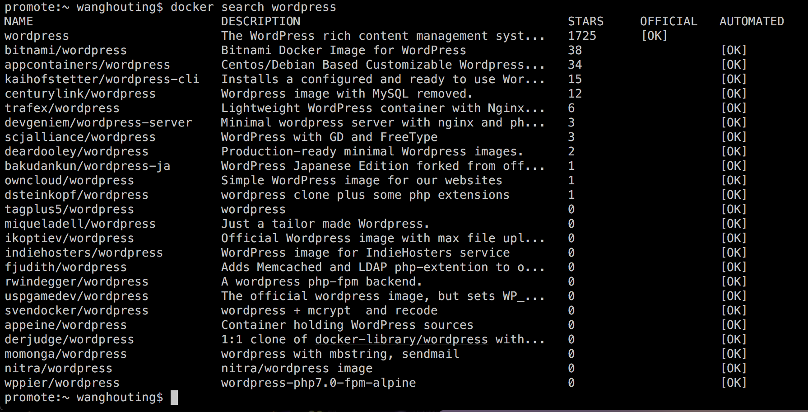

<h1>下载镜像</h1>

&emsp;使用docker run 或 docker create 命令运行或创建一个镜像时，Docker首先会在本机寻找该镜像，如果本机不存在，会继续去Docker Hub上面搜索符合条件的镜像并下载下来运行：

&emsp;使用search命令，可以在Docker Hub上搜索符合条件的镜像：

&emsp;* NAME：镜像的名称，由命名空间和镜像名称构成，如果没有命名空间，说明该镜像属于Docker Hub的官方镜像。

&emsp;* DESCRIPTION：镜像的简要描述，创建者可以登录Docker Hub修改。

&emsp;* STARS：用户对镜像的评分。

&emsp;* OFFICIAL：是否为官方镜像。

&emsp;* AUTOMATED：是否用了自动构建。

&emsp;为了

