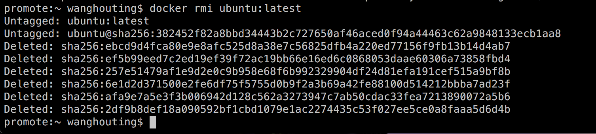
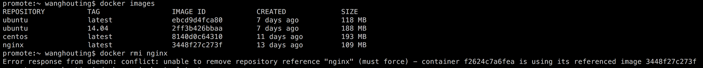

<h1>删除镜像</h1>

&emsp;对于那些不在需要的镜像，可以使用rmi命令删除。与移除容器的命令rm相比，删除镜像的命令多了一个i，i即image的意思。

&emsp;在rmi后面，可以指定一个或多个镜像名称或者镜像ID，其中多个镜像之间用空格隔开。

&emsp;当镜像被容器所依赖时，即便容器已经停止了，是删除不掉的。当然可以使用-f选项进行强制删除，或者先将依赖它的镜像和容器移除

&emsp;测试：当我们使用-f强制删除有容器依赖的镜像后，容器还可以使用吗？

