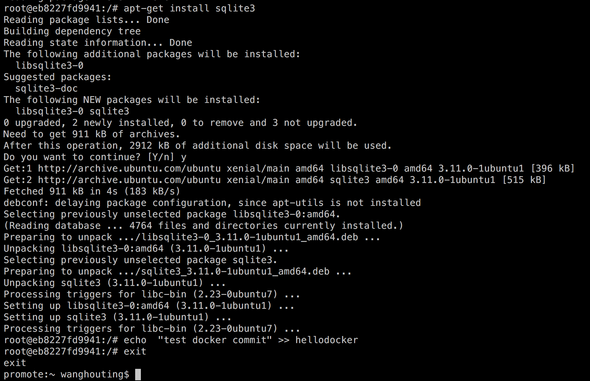
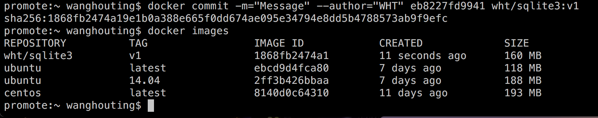

<h1>创建本地镜像</h1>
<h3>1、使用tar包创建</h3>

&emsp; 在前面的章节中，我们知道可以将一个本地的tar包导入为镜像，其前提是该tar包是由镜像导出的。这也算是创建本地镜像的一种方法。

<h3>2、使用commit命令创建</h3>

&emsp;使用镜像创建并运行一个容器，实际上是在父镜像的基础上创建一个可读写的文件层级。我们在容器里所做的修改（包括安装新的应用程序、更改系统配置）都发生在这个层级上面。

&emsp;下面的一系列命令展示了在ubuntu镜像上创建和运行一个容器，并在该容器上创建SQLite3以及在根目录下创建一个名为hellodocker的文件，并且在这个文件中写入test docker commit:

.....................

&emsp;接下来我们使用commit命令将容器里的所有修改提交到本地文件中，形成一个全新的镜像：

&emsp;docker commit -m="Message" --author="WHT" eb8227fd9941 wht/sqlite3:v1

&emsp; 当然也可以将容器的ID（eb8227fd9941）换成容器的名字（sqlite3）

注：docker ps -lq 返回最近创建的容器ID 

&emsp;成功执行commit之后，会返回一个长字符串，这个字符串就是刚创建的镜像的完整ID。-m参数是描述我们此次创建image的信息，--author参数用来指定作者信息，wht和sqlite3分别是仓库和镜像名，v1是TAG名。

&emsp;接下来，我们使用刚才创建的镜像来构建一个容器并运行：

&emsp; docker run -it wht/sqlite3:v1

&emsp;从以上可以看出，SQLite3已经成功安装，同时根目录下的hellodocker文件也存在。

<h3>3、使用Dockerfile创建镜像</h3>

&emsp;与上一种方法相比，更推荐使用Dockerfile来构建镜像。将需要对镜像进行的操作全部写到一个文件中，然后使用docker build命令从这个文件中创建镜像。

&emsp;这种方法可以使镜像的创建变的透明和独立化，并且创建过程可以被重复执行。Dockerfile文件以行为单位，行首为Dockerfile命令，命令都是大写形式，其后紧跟着是名令参数。

&emsp;下面是一个Dockerfile实例：

&emsp;#Version: 1.0.1

&emsp;FROM ubuntu:latest

&emsp;#维护人

&emsp;MAINTATNER wht "wanghouting@163.com" 

&emsp;#设置root用户为后续命令的执行者

&emsp;USER root

&emsp;#执行操作

&emsp;RUN apt-get update

&emsp;RUN apt-get install -y nginx

&emsp;使用&&连接命令

&emsp;RUN touch text.txt && echo "abc" >> abc.txt

&emsp;#du对外暴露端口

&emsp;EXPOSE 80 8080 1038

&eNmsp;

&emsp;

&emsp;

&eNmsp;

&emsp;

&emsp;

&eNmsp;

&emsp;

&emsp;

&eNmsp;

&emsp;

&emsp;

&eNmsp;

&emsp;

&emsp;

&eNmsp;

&emsp;
