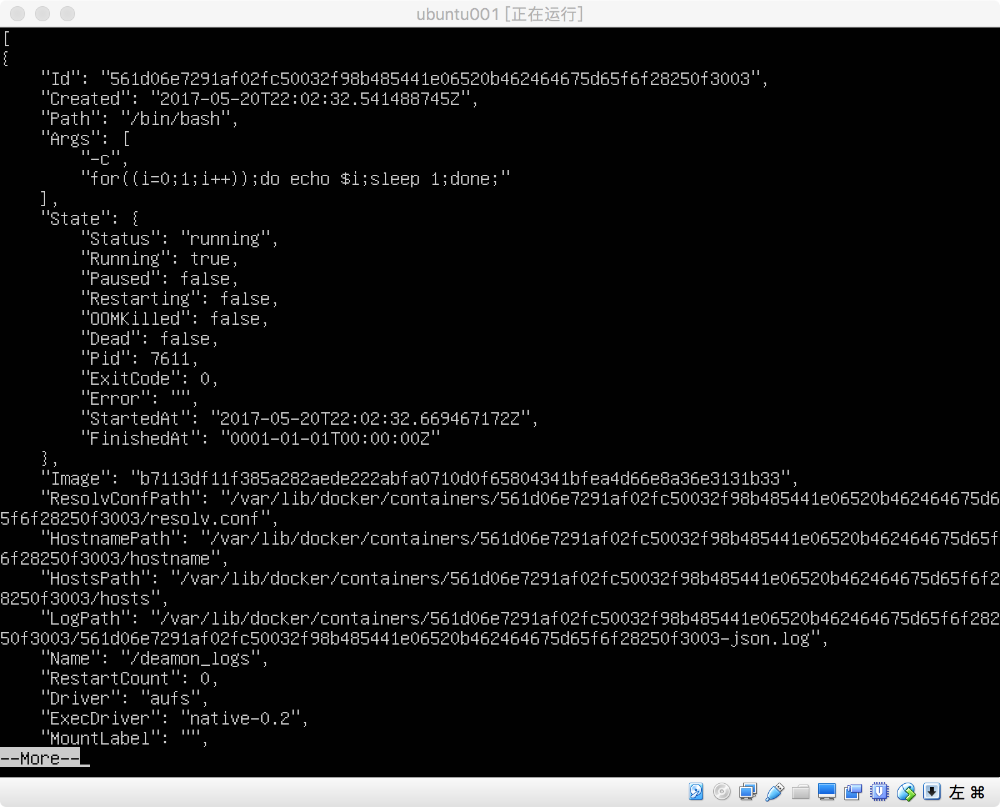

<h1>查看容器信息</h1>

&emsp; docker inspect用于查看容器的配置信息，包含容器名、环境变量、运行命令、主机配置、网络配置和数据卷配置等：

&emsp; 使用-f或者--format格式化标志，可以查看指定部分的信息。

&emsp; 查询容器的运行状态：

&emsp; sudo docker inspect --format='{{ .State.Running }}' deamon_logs

&emsp; 查询容器的ip地址：

&emsp; sudo docker inspect -f='{{ .NetworkSettings.IPAddress }}' daemon_logs

&emsp; 同时还可以查看多个信息，例如查看容器名和运行状态：

&emsp;  sudo docker inspect --format '{{.Name}} {{.State.Running}}' daemon_logs ubuntu

