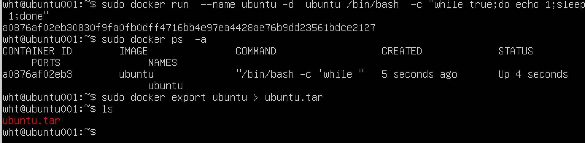
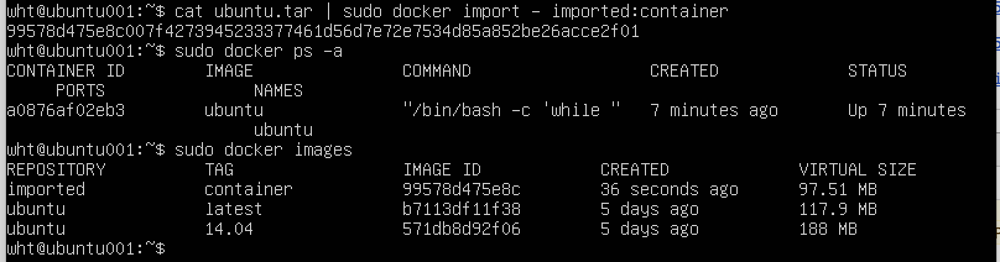

<h1>容器的导入和导出</h1>

&emsp; Docker的流行与它对容器的易分享和易移植密不可分。用户不仅可以把容器提交到公共服务器上，还可以将容器导出到本地文件系统中。同样，我们也可以将导出的容器重新导入到docker运行环境中。docker的导入和导出分别由import命令和export命令完成。

&emsp; 容器的导出 

&emsp; 创建一个容器：

&emsp; sudo docker run -d --name ubuntu ubuntu /bin/bash -c "while true;do echo helloworld;sleep 1;done"

&emsp; sudo docker export ubuntu > ubuntu.tar 

&emsp; dicker export 命令会把容器的文件系统以tar包的格式导出到标准输出，我们将其重定向到目标文件name.tar。将容器保存到本地文件也算是其持久化方式的一种。

&emsp; 容器的导入

&emsp; cat ubuntu.tar | sudo docker import - imported:container

&emsp; docker import会把打包的容器导入为一个镜像。

&emsp; import表示从标准输入读取容器内容，我们把name.tar的内容传给了标准输入，res和tag分表代表生成的镜像和标记。

&emsp; 除了导入本地文件系统的tar包外，还可以使用一个url来导入网上的容器：

&emsp; sudo docker inport url res:tag

