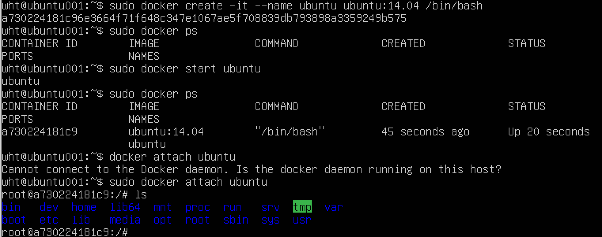

<h1>依附容器</h1>

&emsp; 依附操作attach通常用在由docker start或者docker restart启动的交互型容器中。由于docker start启动的交互型容器并没有具体终端可以依附，而容器本身是可以接收用户交互的，这时就需要通过attach命令将终端依附到容器中。

&emsp; docker run -i -t ubuntu:14.04 /bin/bash

&emsp; 需要注意的是，当使用attach命令依附容器后，需要多按一次回车才会出现容器的shell交互界面。

&emsp; 后台型容器是无法依附终端的，因为它本身就不接受用户交互输入。